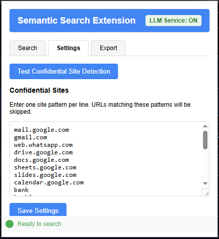
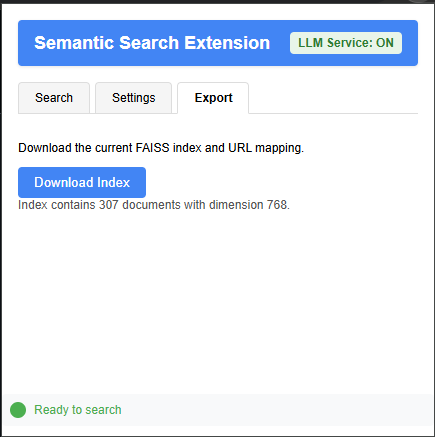

# Semantic Search Chrome Extension

This Chrome extension builds a semantic search index for web pages you visit, allowing you to search for content using natural language queries.

## Features

- **Semantic Indexing:** Builds Nomic embeddings for text content from web pages you visit and creates a FAISS index for efficient semantic search.
- **Confidential Site Skipping:** Automatically skips confidential sites (Gmail, banking, messaging, etc.) based on a customizable list.
- **Semantic Search:** Search through your indexed browsing history using natural language queries.
- **Result Highlighting:** Highlights all occurrences of your search terms on the original page, with robust handling for navigation and page reloads.
- **Notifications:** Real-time notifications for indexing status, including confidential site skips, errors, and completions.
- **Settings:** Easily view and edit the confidential sites list from the extension popup.
- **Export:** Download your search index and view index statistics.
- **Test Data:** Built-in test data for quick verification of extension functionality.
- **Robust Error Handling:** Improved error and status reporting in both the popup and background scripts.

## Screenshots

### Search Tab

### Settings Tab

### Export/Download Tab

## Installation

1. Clone or download this repository.
2. Open Chrome and navigate to `chrome://extensions/`.
3. Enable "Developer mode" by toggling the switch in the top-right corner.
4. Click "Load unpacked" and select the directory containing the extension files.
5. The extension should now be installed and active.

## Usage

### Searching

1. Click the extension icon to open the popup.
2. Enter your search query in the "Search" tab.
3. Optionally, enable "Highlight searched text" to highlight results on the page.
4. Click a result to open the page and highlight all matches.

### Indexing

- The extension automatically indexes non-confidential pages you visit.
- Confidential sites are skipped, and you'll see a notification if a page is skipped.

### Managing Confidential Sites

1. Go to the "Settings" tab in the popup.
2. Edit the list of confidential sites (one per line).
3. Click "Save Settings" to update the list.
4. Use the "Test Confidential Site Detection" button to verify if a URL would be skipped.

### Exporting and Stats

1. Go to the "Export" tab in the popup.
2. Download your current FAISS index and URL mapping.
3. View statistics about your index (number of documents, dimension, etc.).

## Troubleshooting

### Viewing Debug Logs

1. Go to `chrome://extensions/`.
2. Find the Semantic Search Extension.
3. Click on "Service Worker" under "Inspect views".
4. The console will show detailed logs about extension activity.

### Common Issues

- **No search results:** Ensure pages are being indexed (check logs).
- **Confidential site not skipped:** Use the test button in Settings to verify detection.
- **Highlighting not working:** Make sure the content script is injected and the page is fully loaded.

### Resetting Status

- After a "Page skipped" or error notification, the status will automatically reset to "Ready to search" after a few seconds.

## Privacy

- All data is stored locally in your browser.
- No browsing data is sent to external servers.
- Confidential sites are never indexed.
- You control the confidential sites list.

## Customization

- Edit `confidential-sites.json` or use the Settings tab to manage confidential domains.

## License

MIT 