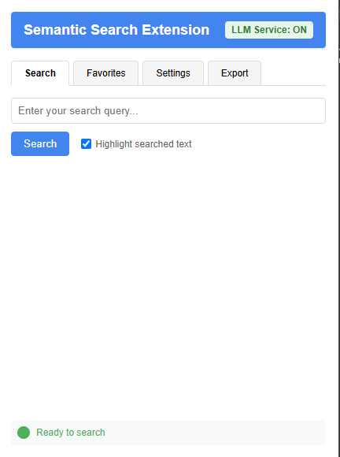
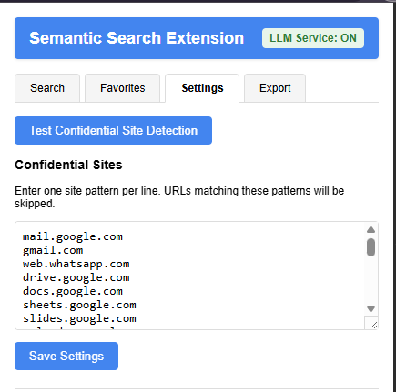
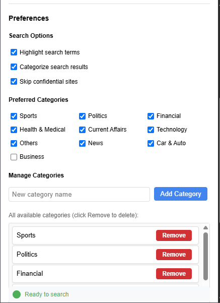
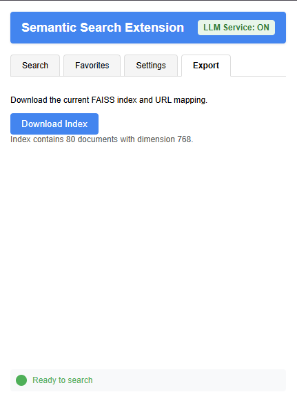

# Semantic Search Chrome Extension

An intelligent Chrome extension that builds a semantic search index for web pages you visit, powered by a **4-Layer Cognitive Architecture** that provides personalized, context-aware search capabilities using natural language queries.

## Overview

This extension uses advanced AI/ML techniques including Nomic embeddings, FAISS vector search, and a cognitive agent system to provide intelligent, personalized semantic search. The backend implements a cognitive architecture with Perception, Memory, Decision-Making, and Action layers that work together to understand user intent and deliver relevant, personalized search results.

**For detailed technical documentation about the architecture, see [REFACTORING_SUMMARY.md](REFACTORING_SUMMARY.md).**

## Features

### Core Search Features
- **Semantic Indexing:** Builds Nomic embeddings for text content from web pages you visit and creates a FAISS index for efficient semantic search.
- **Cognitive Agent Search:** Powered by a 4-layer cognitive architecture that understands context and user intent.
- **Personalized Search:** Search results are automatically personalized based on your preferences, interests, and browsing patterns.
- **Natural Language Queries:** Search through your indexed browsing history using natural language queries with semantic understanding.
- **Result Highlighting:** Highlights all occurrences of your search terms on the original page, with robust handling for navigation and page reloads.
- **Content Categorization:** Automatically categorizes search results into 7 categories (Sports, Politics, Financial, Health & Medical, Current Affairs, Technology, Others) or custom categories you create.

### User Experience Features
- **User Preferences Management:** Customize your search experience with interests, location, favorite topics, and preferred categories.
- **Favorites System:** Save and manage your favorite search results for quick access.
- **Confidential Site Skipping:** Automatically skips confidential sites (Gmail, banking, messaging, etc.) based on a customizable list.
- **Search Options:** Configure highlighting, categorization, and confidential site filtering based on your preferences.
- **Category Management:** Create, view, and manage custom content categories.

### Technical Features
- **Notifications:** Real-time notifications for indexing status, including confidential site skips, errors, and completions.
- **Export/Import:** Download your search index and view index statistics.
- **Robust Error Handling:** Improved error and status reporting in both the popup and background scripts.
- **Backend API:** RESTful Flask backend with comprehensive API endpoints.

## Architecture

The extension implements a **4-Layer Cognitive Architecture** with an Agent orchestrator:

```
User Query → Cognitive Agent → Perception → Memory → Decision → Action → Results
```

### Cognitive Layers

1. **Perception Layer** (`backend/app/services/perception/`)
   - Analyzes user queries to determine intent
   - Categorizes content into predefined or custom categories
   - Extracts keywords from queries
   - Calculates relevance scores based on user preferences
   - Uses Nomic embedding model for semantic understanding

2. **Memory Layer** (`backend/app/services/memory/`)
   - **Long-term Memory:** FAISS index for persistent semantic search
   - **Short-term Memory:** In-memory storage for recent context (1 hour timeout)
   - **User Preferences Storage:** JSON file storage for user settings
   - Filters results based on user preferences
   - Skips confidential sites based on user preference

3. **Decision-Making Layer** (`backend/app/services/decision/`)
   - Determines what actions to take (search, highlight, categorize, favorite)
   - Categorizes content based on keywords and user preferences
   - Scores results based on relevance and user preferences
   - Applies filtering rules (confidential sites, categories)
   - Prioritizes actions

4. **Action Layer** (`backend/app/services/action/`)
   - Executes search operations
   - Applies highlighting to search terms
   - Categorizes search results
   - Manages favorites functionality
   - Returns formatted results

### Agent Orchestrator
- **Location:** `backend/app/agent/cognitive_agent.py`
- Coordinates all cognitive layers to process user queries
- Manages the flow of information through the system
- Integrates user context and preferences into search processing

## Screenshots

### Search Tab



### Settings Tab



### Export/Download Tab


## Installation

### Prerequisites

- **Python 3.11 or 3.12** (recommended: 3.11)
- **Chrome Browser** (latest version)
- **API Keys:**
  - **NOMIC_API_KEY** (Required): Get from https://atlas.nomic.ai/
  - **GEMINI_API_KEY** (Optional): Get from https://makersuite.google.com/app/apikey

### Step 1: Backend Setup

1. **Navigate to the backend directory:**
   ```bash
   cd backend
   ```

2. **Install dependencies:**

   **Option A: Using uv (Recommended)**
   ```bash
   uv pip install -r requirements.txt
   ```

   **Option B: Using pip**
   ```bash
   python -m venv venv
   # On Windows:
   venv\Scripts\activate
   # On Linux/Mac:
   source venv/bin/activate
   
   pip install -r requirements.txt
   ```

3. **Configure environment variables:**

   Create a `.env` file in the `backend` directory:
   ```env
   NOMIC_API_KEY=your-nomic-api-key-here
   GEMINI_API_KEY=your-gemini-api-key-here
   SECRET_KEY=dev-key-please-change-in-production
   ```

4. **Start the backend server:**

   **Development Mode:**
   ```bash
   python wsgi.py
   ```
   
   Or using Flask CLI:
   ```bash
   flask run
   ```

   The server will start on `http://localhost:5000`

   **Production Mode:**
   ```bash
   gunicorn -w 4 -b 0.0.0.0:5000 wsgi:app
   ```

   See [backend/README.md](backend/README.md) for more detailed backend setup instructions.

### Step 2: Extension Setup

1. **Ensure the backend is running** on `http://localhost:5000`

2. **Open Chrome** and navigate to `chrome://extensions/`

3. **Enable Developer mode** by toggling the switch in the top-right corner

4. **Click "Load unpacked"** and select the directory containing the extension files (the root directory of this repository)

5. The extension should now be installed and active. Check the extension popup - it should show "LLM Service: ON" when the backend is connected.

## Usage

### Searching

1. Click the extension icon to open the popup
2. Enter your search query in the "Search" tab
3. Optionally, enable "Highlight searched text" to highlight results on the page
4. Click a result to open the page and highlight all matches

**Note:** Search results are automatically personalized based on your preferences and will be categorized if categorization is enabled in your preferences.

### Setting User Preferences

1. Open the extension popup
2. Go to the "Settings" tab
3. Scroll to the "Preferences" section
4. Fill in your preferences:
   - **Interests:** Your general interests (e.g., "technology, AI, machine learning")
   - **Location:** Your location (e.g., "United States")
   - **Favorite Topics:** Topics you're particularly interested in
   - **Search Options:**
     - Highlight search terms
     - Categorize search results
     - Skip confidential sites
   - **Preferred Categories:** Select the categories you want to see in search results
5. Click "Save Preferences" to apply your settings

Your preferences are automatically used to personalize search results and filter content based on your interests.

### Managing Favorites

1. **Adding to Favorites:**
   - Perform a search
   - Click "Add to Favorites" button on any search result
   - The result will be saved to your favorites

2. **Viewing Favorites:**
   - Go to the "Favorites" tab in the extension popup
   - View all your saved favorites
   - Click on any favorite to open the page

3. **Removing Favorites:**
   - In the "Favorites" tab, click "Remove" next to any favorite item

### Managing Categories

1. Go to the "Settings" tab
2. Scroll to "Manage Categories" section
3. **Add a new category:**
   - Enter the category name in the input field
   - Click "Add Category"
4. **Remove a category:**
   - Scroll through the list of available categories
   - Click "Remove" next to any category you want to delete

### Indexing

- The extension automatically indexes non-confidential pages you visit
- Confidential sites are skipped, and you'll see a notification if a page is skipped
- Indexing happens in the background as you browse

### Managing Confidential Sites

1. Go to the "Settings" tab in the popup
2. Edit the list of confidential sites (one per line)
3. Click "Save Settings" to update the list
4. Use the "Test Confidential Site Detection" button to verify if a URL would be skipped

### Exporting and Stats

1. Go to the "Export" tab in the popup
2. Download your current FAISS index and URL mapping
3. View statistics about your index (number of documents, dimension, etc.)

## API Endpoints

The backend provides the following RESTful API endpoints:

### Core Search & Indexing
- `GET /api/health` - Server status and index size
- `POST /api/index` - Index a web page (requires: url, content, optional: title)
- `POST /api/search` - Semantic search (requires: query, optional: user_context, limit)
- `POST /api/check-indexed` - Check if a URL is indexed (requires: url)

### User Preferences
- `GET /api/preferences` - Get user preferences
- `POST /api/preferences` - Update user preferences (requires: preferences object)

### Favorites
- `GET /api/favorites` - Get favorites list
- `POST /api/favorites` - Add to favorites (requires: url, title, content)
- `DELETE /api/favorites` - Remove from favorites (requires: url)

### Categorization
- `POST /api/categorize` - Categorize content (requires: results array)
- `GET /api/categories` - Get available categories
- `POST /api/categories` - Add new category (requires: name)
- `DELETE /api/categories` - Delete category (requires: name)
- `POST /api/classification/feedback` - Provide classification feedback

### Utilities
- `GET /api/stats` - Get index statistics
- `GET /api/download-index` - Download FAISS index and metadata as ZIP
- `POST /api/regenerate-test-data` - Regenerate test data in the index
- `POST /api/clear-index` - Clear all indexed data
- `POST /api/embed` - Generate embedding for text (requires: text)
- `POST /api/chat` - Chat with Gemini AI (requires: query, optional: history)

For detailed API documentation, see the backend code in `backend/app/api/routes.py`.

## Troubleshooting

### Backend Issues

#### Viewing Backend Logs
The backend server logs are displayed in the terminal where you started it. Look for INFO level messages about requests and operations.

#### Backend Not Starting
- **Import Errors with FAISS:**
  - Ensure you're using Python 3.11 or 3.12
  - Reinstall faiss-cpu: `pip uninstall faiss-cpu && pip install faiss-cpu==1.7.4`
  - Verify numpy compatibility: `pip install "numpy>=1.24.0,<1.27.0"`

- **API Key Errors:**
  - Verify the `.env` file exists in the `backend` directory
  - Check that the file contains `NOMIC_API_KEY=your-actual-key`
  - Restart the server after adding the key

- **Port Already in Use:**
  - Change the port in `backend/wsgi.py`: `app.run(host='0.0.0.0', port=5001, debug=True)`
  - Update the extension's API endpoint if needed (check `popup.js` and `background.js`)

#### Backend Connection Issues
- Ensure the backend is running on `http://localhost:5000`
- Check that the extension popup shows "LLM Service: ON"
- If it shows "OFF", verify the backend is accessible and check browser console for errors

### Extension Issues

#### Viewing Extension Debug Logs
1. Go to `chrome://extensions/`
2. Find the Semantic Search Extension
3. Click on "Service Worker" under "Inspect views"
4. The console will show detailed logs about extension activity

For content script logs, inspect the web page you're on (right-click → Inspect → Console tab).

#### Common Issues
- **No search results:**
  - Ensure pages are being indexed (check service worker logs)
  - Verify the backend is running and accessible
  - Check that the FAISS index has been populated

- **Confidential site not skipped:**
  - Use the test button in Settings to verify detection
  - Check your confidential sites list configuration

- **Highlighting not working:**
  - Make sure the content script is injected and the page is fully loaded
  - Check browser console on the page for errors

- **Preferences not saving:**
  - Verify backend is running
  - Check service worker logs for API errors
  - Ensure the backend has write access to `backend/data/user_preferences.json`

- **Backend connection shows "OFF":**
  - Verify backend server is running on port 5000
  - Check for CORS errors in the browser console
  - Ensure firewall isn't blocking localhost connections

### Resetting Status
- After a "Page skipped" or error notification, the status will automatically reset to "Ready to search" after a few seconds

### Clearing All Data
If you need to start fresh:
1. Go to Settings tab
2. Scroll to "Danger Zone"
3. Click "Clear All Indexed Data"
4. **Warning:** This action cannot be undone

## Technical Details

### File Structure

```
Session-7/
├── backend/
│   ├── app/
│   │   ├── agent/
│   │   │   └── cognitive_agent.py      # Main orchestrator
│   │   ├── api/
│   │   │   └── routes.py                # API endpoints
│   │   ├── config/
│   │   │   └── system_prompts.json      # AI system prompts
│   │   └── services/
│   │       ├── action/
│   │       │   └── action_layer.py      # Action layer
│   │       ├── decision/
│   │       │   └── decision_layer.py    # Decision layer
│   │       ├── memory/
│   │       │   └── memory_layer.py      # Memory layer
│   │       ├── perception/
│   │       │   └── perception_layer.py  # Perception layer
│   │       ├── classifier.py            # Content classification
│   │       ├── embedding.py             # Embedding utilities
│   │       ├── faiss_index.py           # FAISS index management
│   │       ├── gemini_chat.py           # Gemini AI integration
│   │       └── nomic_embed.py           # Nomic embeddings
│   ├── data/
│   │   ├── faiss_index                  # FAISS index files
│   │   ├── faiss_index.json            # Index metadata
│   │   └── user_preferences.json       # User preferences
│   ├── config.py                        # Configuration
│   ├── requirements.txt                 # Python dependencies
│   ├── wsgi.py                          # WSGI application entry
│   └── README.md                        # Backend documentation
├── popup.html                           # Extension popup UI
├── popup.js                             # Popup logic
├── background.js                        # Background service worker
├── content.js                           # Content script
├── manifest.json                        # Extension manifest
└── REFACTORING_SUMMARY.md               # Detailed architecture docs
```

### Memory Management
- **Long-term Memory:** FAISS index persisted to disk at `backend/data/faiss_index`
- **Short-term Memory:** In-memory storage with 1-hour timeout for recent context
- **User Preferences:** JSON file storage at `backend/data/user_preferences.json`
- **Favorites:** Stored in user preferences JSON file

### Categorization
- Default categories: Sports, Politics, Financial, Health & Medical, Current Affairs, Technology, Others
- Custom categories can be added by users
- Keyword-based detection with embedding-prototype support
- Category preferences can be set in user preferences

### Dependencies

#### Backend Dependencies
| Package | Version | Purpose |
|---------|---------|---------|
| flask | 3.0.3 | Web framework |
| flask-cors | 4.0.1 | CORS support |
| python-dotenv | 1.0.1 | Environment variables |
| faiss-cpu | 1.7.4 | Vector similarity search |
| numpy | >=1.24.0,<1.27.0 | Numerical operations |
| nomic | 3.6.0 | Embedding generation |
| google-generativeai | 0.8.3 | Gemini AI integration |
| gunicorn | 23.0.0 | Production WSGI server |
| requests | 2.31.0 | HTTP client |

#### Frontend Dependencies
- Chrome Extension Manifest V3
- FAISS-WASM for client-side vector operations
- Nomic Embed Text library for embeddings

## Privacy

- **Local Storage:** All data is stored locally on your machine
- **Backend:** Runs locally on your machine (`localhost:5000`)
- **API Keys:** Used only for embedding generation and optional Gemini chat features
- **No External Servers:** No browsing data is sent to external servers (except API calls to Nomic/Gemini for embeddings/AI features)
- **Confidential Sites:** Confidential sites are never indexed
- **User Control:** You control the confidential sites list and all preferences

## Customization

### Confidential Sites
- Edit `confidential-sites.json` directly, or use the Settings tab to manage confidential domains
- Sites matching patterns in this list will be automatically skipped during indexing

### System Prompts
- AI system prompts can be customized in `backend/app/config/system_prompts.json`
- Supports personalization parameters based on user preferences

### Categories
- Default categories can be customized through the Settings UI
- Add custom categories that match your browsing interests

## Development

### Backend Development
- The backend uses Flask's application factory pattern
- Services are modular and can be easily extended
- FAISS index is persisted to disk at `backend/data/`
- Logs are configured to show INFO level messages

### Extension Development
- Service worker handles background tasks and page indexing
- Content script handles highlighting on web pages
- Popup UI uses vanilla JavaScript (no frameworks)
- Communication between components uses Chrome extension messaging API

## License

MIT

## Additional Documentation

- **[REFACTORING_SUMMARY.md](REFACTORING_SUMMARY.md)** - Detailed technical documentation about the cognitive architecture
- **[backend/README.md](backend/README.md)** - Backend-specific setup and documentation
